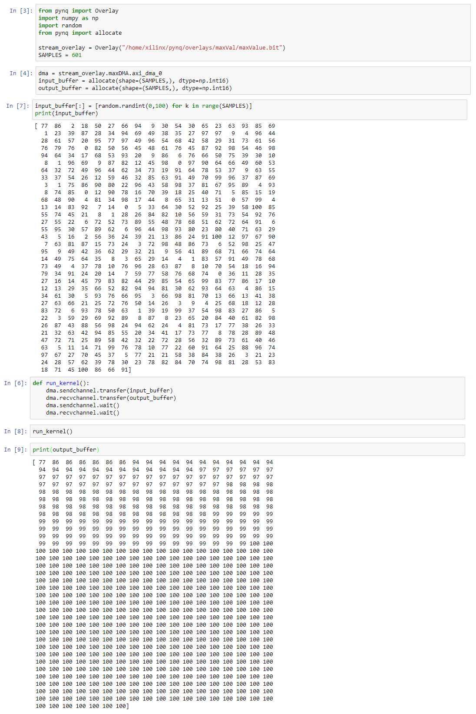

# triad_finder
Finds the three most prominent music notes played in a given `.wav` file.

## Project Update

For our next steps, we implemented some C++ code that uses the AXI4-stream to give the hardware a range of random values from 0-100 and output the running maximum as an output stream. This code can be found in the Jupyter notebook file [here](david/project_update.ipynb), and can be seen running below:

This maximum value finder will later be implemented to get the maximum amplitude found in the FFT, and the software will then use that amplitude and it's index to find the frequency of the harmonic of the given buffer of WAVEFILE data.
